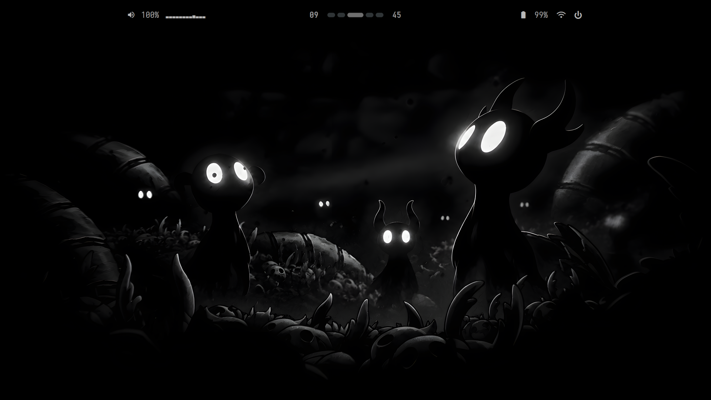
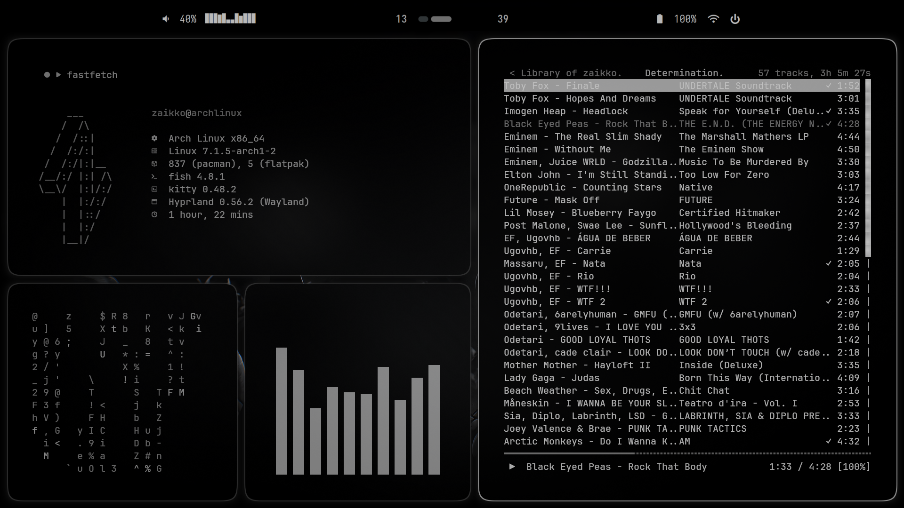
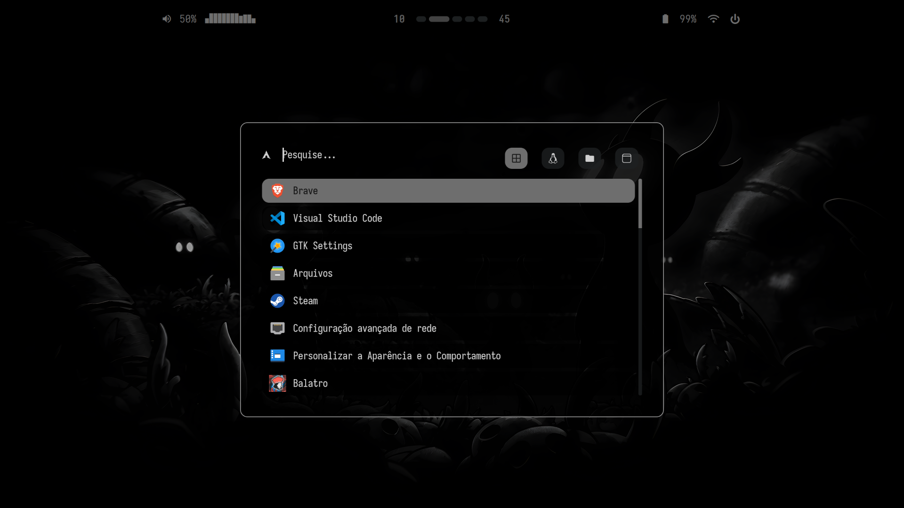
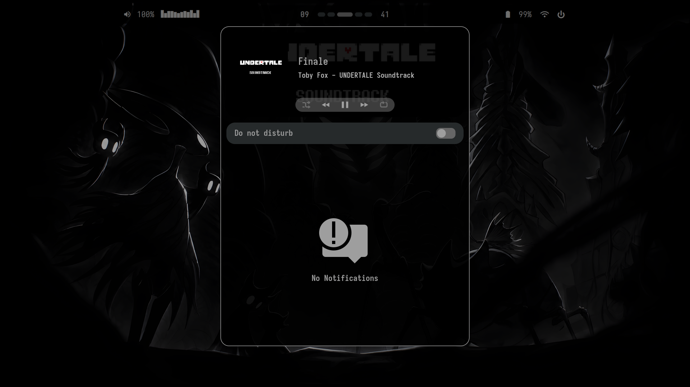

# Singularity Dotfiles &nbsp;



My personal Arch Linux rice: **Hyprland** + **Kitty** + **Waybar** (with Cava audio
visualizer), tied together with a Lua-based Hyprland config.

## Installation

### ⚠️ Requirements ⚠️

**Arch Linux** with **yay** installed as your AUR helper.

### Steps

1. Install git:
```bash
sudo pacman -S git
```

2. Clone the repository:
```bash
cd $HOME
git clone https://github.com/zaikkoo/singularity
cd singularity
```

3. Run the installer:
```bash
chmod +x LAUNCH.sh
./LAUNCH.sh
```

This installs the pacman + AUR dependencies and symlinks every config folder
into `~/.config` (backing up anything already there). Log out and back in
(or reboot) afterwards to start Hyprland with the rice applied.

## Keybinds

Programs used: **Kitty** (Terminal), **Nautilus** (File Manager), **Rofi** (Launcher).

### 🚀 Launch Applications

| Action        | Keybind      | Description                    |
|----------------|---------------|----------------------------------|
| Terminal      | `SUPER + Q`  | Launch kitty                   |
| File Manager  | `SUPER + E`  | Launch nautilus                |
| App Launcher  | `SUPER + D`  | Launch rofi launcher           |

---

### 🧰 System Scripts

| Action                          | Keybind                                | Description                                 |
|-----------------------------------|-------------------------------------------|-----------------------------------------------|
| Power Menu                      | `SUPER + M`                            | Runs hyprshutdown (or exits Hyprland)       |
| Reload Waybar                   | `SUPER + R`                            | Runs the waybar launch script                |
| Notification Center             | `SUPER + N`                            | Toggles swaync                               |
| Screenshot (region, clipboard)  | `SUPER + SHIFT + PRINT`                | Region screenshot via hyprshot               |
| Screenshot (output, clipboard)  | `SUPER + PRINT`                        | Full output screenshot via hyprshot          |

---

### 🪟 Window Actions

| Action           | Keybind      | Description                             |
|-------------------|---------------|--------------------------------------------|
| Kill Window      | `SUPER + C`  | Close the focused window                |
| Toggle Floating  | `SUPER + V`  | Toggle floating for active window       |
| Pseudo Tile      | `SUPER + P`  | Toggle pseudotile                       |
| Toggle Split     | `SUPER + J`  | Toggle split orientation (dwindle only) |
| Fullscreen       | `SUPER + F`  | Toggle fullscreen mode                  |

---

### 📌 Window Focus

Move focus with `SUPER + arrow keys`:

| Direction | Keybind        |
|-----------|------------------|
| Left      | `SUPER + ←`    |
| Right     | `SUPER + →`    |
| Up        | `SUPER + ↑`    |
| Down      | `SUPER + ↓`    |

---

### 🔢 Workspaces

| Action                                  | Keybind                     |
|--------------------------------------------|--------------------------------|
| Switch to workspace 1-10               | `SUPER + 1-9, 0` (0 = 10)   |
| Move window to workspace 1-10          | `SUPER + SHIFT + 1-9, 0`   |
| Toggle special workspace (scratchpad)  | `SUPER + S`                 |
| Move window to special workspace       | `SUPER + SHIFT + S`         |
| Scroll to next/previous workspace      | `SUPER + Scroll Down/Up`    |

---

### 🖱️ Mouse

| Action        | Keybind                    |
|----------------|-------------------------------|
| Move window   | `SUPER + Left Click` drag    |
| Resize window | `SUPER + Right Click` drag   |

## Details

- OS: **[Arch Linux](https://archlinux.org)**
- WM: **[Hyprland](https://github.com/hyprwm/Hyprland)** (config in Lua)
- Bar: **[Waybar](https://github.com/Alexays/Waybar)** ([waybar-cava-git](https://aur.archlinux.org/packages/waybar-cava-git) build, with Cava audio visualizer)
- Terminal: **[Kitty](https://github.com/kovidgoyal/kitty)**
- Launcher: **[Rofi](https://github.com/davatorium/rofi)**
- Notifications: **[SwayNC](https://github.com/ErikReider/SwayNotificationCenter)**
- Shell: **[Fish](https://fishshell.com)**
- Wallpaper: **[awww](https://codeberg.org/wobbl/awww)** (successor to swww)
- System info: **[Fastfetch](https://github.com/fastfetch-cli/fastfetch)**
- Icons: **Papirus-Dark**
- Cursor: **[apple_cursor](https://aur.archlinux.org/packages/apple_cursor)** (macOS-style)

## Screenshots





